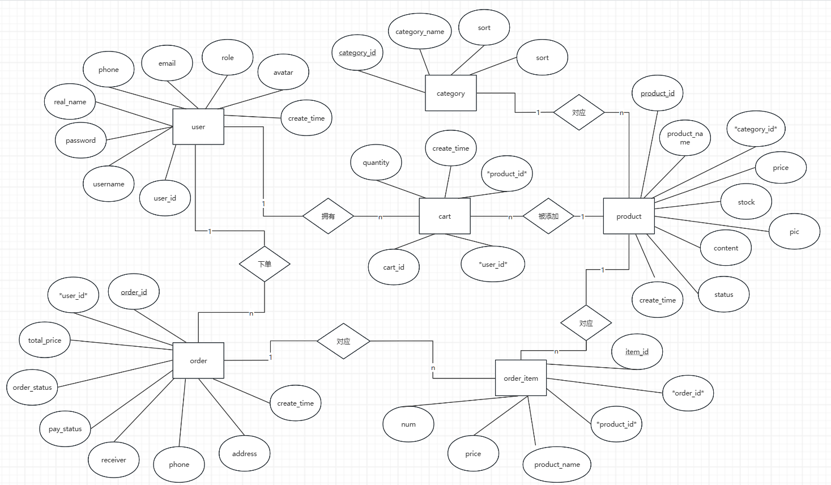

# 数据库设计说明

## 1. E-R 图

## 2. 关系模型
- user(user_id, username, password, real_name, phone, email, role, avatar, create_time)
- category(category_id, category_name, sort, description)
- product(product_id, product_name, category_id, price, stock, pic, content, status, create_time)
- cart(cart_id, user_id, product_id, quantity, create_time) 
- order(order_id, user_id, total_price, order_status, pay_status, receiver, phone, address, create_time)
- order_item(item_id, order_id, product_id, product_name, price, num)

## 3. 表结构设计要点
- **用户表(user)**：存储系统三种角色（普通用户、管理员）的基础信息，username 建立了唯一索引。
- **商品表(product)**：通过 category_id 与分类表关联，实现一对多。
- **购物车表(cart)**：建立了联合唯一索引 `UNIQUE(user_id, product_id)`，防止同一用户重复添加同一个商品。
- **订单表(order)与订单明细表(order_item)**：一对多关系，订单明细表保存了商品名称的快照，防止商品信息修改后影响历史订单。
- **外键约束**：所有关联表均设有准确的外键，并配置了级联删除（ON DELETE CASCADE）和限制删除（ON DELETE RESTRICT）。